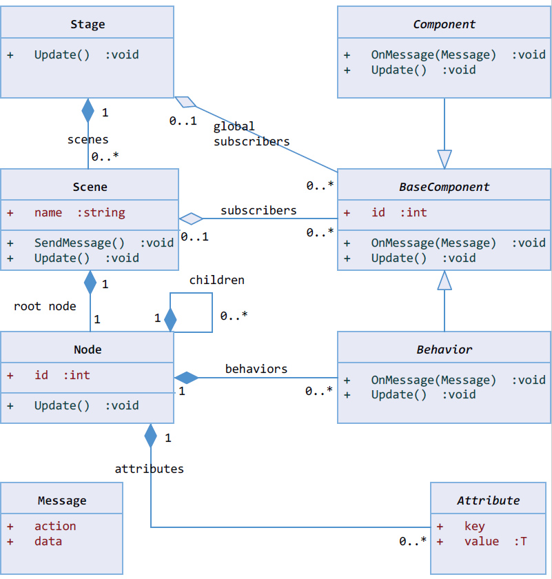
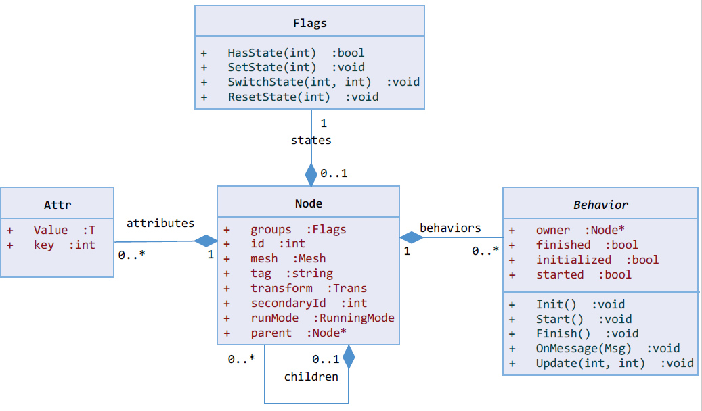

#Architecture

CogEngine is a game engine that uses component-oriented approach. Functionality of each game objects s defined by collection of behaviors the object contains. The Behavior class represents a component.  

Engine uses also global components, represented by classes derived from BaseComponent class. Such components exist during the whole application lifetime and may be used directly.

Game scene is stored in a component called Stage. This component contains collection of scenes and each scene contains collection of nodes. Node represents a game object and each game object may have collection of behaviors, states and generic attributes.

[Home](Readme.md)

