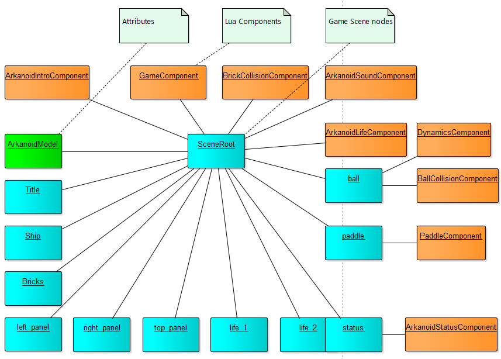
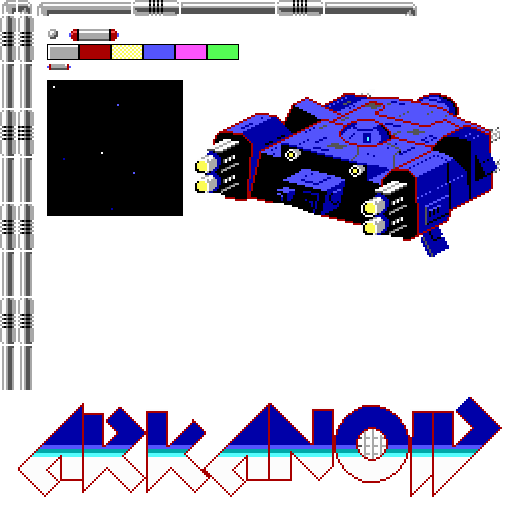

Arkanoid
===================

Clone of a 1986 computer game. The player controls a paddle/vessel which prevents a ball from falling, attempting to destroy all bricks.

## Platforms
* Windows
* Linux

## Implemented mechanics
* Paddle controller
* Intro scene (just a dummy image)
* Very simple collision handler
* Multiple levels
* Game over

## Technical notes
* All game components are implemented in both C++ and Lua (however only one language is running at a time)
* **To use C++ components, remove <code>ARKANOID_LUA</code> directive at the beginning of <code>ArkanoidFactory.cpp</code> file**
* All Lua scripts are located in Data/Arkanoid.lua

## Architecture
* The game uses raw component architecture (ECS pattern)

## Sprites
* Game uses a sprite atlas instead of set of images

## Configuration
* Sprites and levels are declared in Data/data.json

<code>
Example: level declaration (each brick has its own code)

	"levels_maps" : [
	  [
		[0,0,0,0,0,0,0,0,0,0,0],
		[0,0,0,0,0,0,0,0,0,0,0],
		[0,0,0,0,0,0,0,0,0,0,0],
		[1,1,1,1,1,1,1,1,1,1,1],
		[2,2,2,2,2,2,2,2,2,2,2],
		[3,3,3,3,3,3,3,3,3,3,3],
		[4,4,4,4,4,4,4,4,4,4,4],
		[5,5,5,5,5,5,5,5,5,5,5],
		[6,6,6,6,6,6,6,6,6,6,6],
		[0,0,0,0,0,0,0,0,0,0,0],
		[0,0,0,0,0,0,0,0,0,0,0],
		[0,0,0,0,0,0,0,0,0,0,0],
		[0,0,0,0,0,0,0,0,0,0,0],
		[0,0,0,0,0,0,0,0,0,0,0],
		[0,0,0,0,0,0,0,0,0,0,0],
		[0,0,0,0,0,0,0,0,0,0,0]
     ],

</code>

## Control
* LEFT ARROW - move paddle to the left
* RIGHT ARROW - move paddle to the right
* LEFT ALT - release the ball

## Installation

- install <a href="https://openframeworks.cc/" target="_blank">OpenFrameworks </a> framework, following instructions on their web. Recommended version is 0.9.8.
- install the CogEngine. Open the VS solution file and fix paths to both frameworks.
