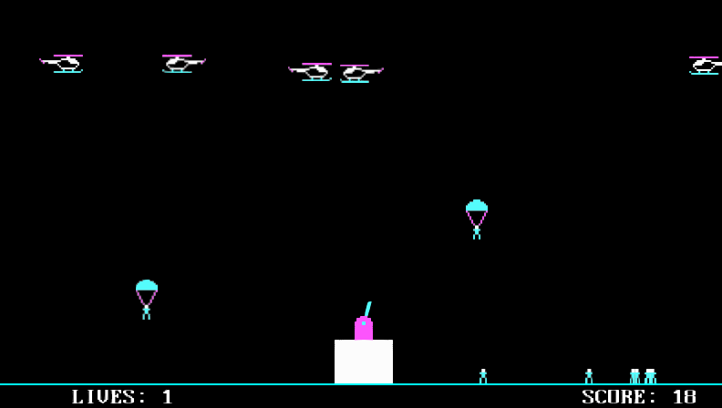

Paratrooper
===================

Clone of a 1982 computer game. The player controls a turret and earns points by shooting helicopters and paratroopers.

<a href="http://www.youtube.com/watch?feature=player_embedded&v=32I-xNd4JNg
" target="_blank">Watch Gameplay</a>

## Platforms
* Windows
* Linux

## Implemented mechanics
* Paratroopers
* Helicopters
* Turret control and firing (added gravity)
* Game over (simplified capturing animation)

## Technical notes
* The game uses raw component architecture (ECS pattern)
* Components communicate via message passing
* Configurable attributes are located in <code>Data/config.json</code>

## Control
* LEFT ARROW - rotate cannon left
* RIGHT ARROW - rotate cannon right
* LEFT ALT - fire

## Installation

- install <a href="https://openframeworks.cc/" target="_blank">OpenFrameworks </a> framework, following instructions on their web. Recommended version is 0.9.8.
- install CogEngine game engine. Open the VS solution file and fix paths to both frameworks.
