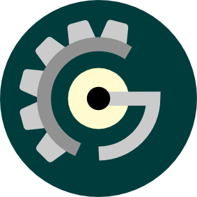

ofxCogEngine
===================

## What's the CogEngine?

CogEngine stands for C++ component-oriented game engine. It can be used as a tool for creating 2D windows or mobile games. It is implemented as an [OpenFrameworks](http://openframeworks.cc) addon. Windows and Android platforms are supported.

## Features
* Transformation components
* Animations
* Finite state machines
* Goal-driven behavior components
* Steering behaviors
* Monte-Carlo tree search 
* Path-finding
* SQLite database
* Easing functions
* Networking for multiplayer
* XML configuration
* Binding to Lua scripting language

## How to use it
This documentation comprises these three parts:

* [Why do we need yet another C++ Test Framework?](docs/why-catch.md)
* [Tutorial](docs/tutorial.md) - getting started
* [Reference section](docs/Readme.md) - all the details

## Compatibility

Works with OpenFrameworks 0.9.1

## LICENSE and ATTRIBUTIONS

ofxCogEngine is made available under the [MIT](http://opensource.org/licenses/MIT) license.
ofxCogEngine bundles catch framework, lua scripting language, luabridge binder, sqlite and following OpenFrameworks addons: ofxNetwork, ofxSQLite, ofxTextLabel, ofxXmlSettings
